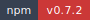
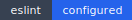

<!-- markdownlint-disable MD013 MD033 -->
<!-- This file is generated by Paradox. Do not edit manually. -->

# DOCTOR

        

Executable doctor provider and standalone CLI for lightweight Ankhorage repo and package compliance diagnostics.

## Usage

### Provider and CLI surface

`@ankhorage/doctor` is the repo/package compliance provider for Ankhorage.

The same shared command implementation backs both:

- `ankh doctor ...`
- `bunx @ankhorage/doctor ...`

Current command surface:

- `validate`
- `fix`
- `repo`
- `package`

`doctor#2` adds a profile-based policy engine:

- strict `public-package` validation for extracted public package repos
- light recognized `integration-monorepo` validation for `ankhorage4`
- non-mutating `fix` plans for deterministic mechanical changes only

Still deferred:

- GitHub checks
- CI checks
- on-disk `fix --apply`
- deeper cross-repo policy enforcement

Path handling:

- pass `[path]`, or
- omit it to inspect the current working directory

Source: `src/readme-usage.ts`

```ts
import { runCli } from './cli.js';

await runCli(['--help']);
```

## Installation

```bash
bunx @ankhorage/doctor
```

## Generated documentation

- [Interactive documentation app](././paradox/index.html)
- [Public API reference](././paradox/exports.md)
- [Component registry](././paradox/components.md)
- [Architecture overview](././paradox/diagrams/architecture-overview.mmd)
- [Module relationships](././paradox/diagrams/module-relationships.mmd)
- [Export graph](././paradox/diagrams/export-graph.mmd)
- [ankhorage-doctor sequence](././paradox/diagrams/sequences/ankhorage-doctor.mmd)
- [createDoctorRuntimeProvider sequence](././paradox/diagrams/sequences/create-doctor-runtime-provider.mmd)
